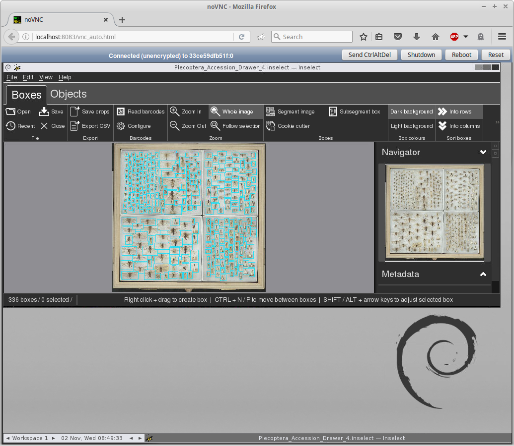

# inselect-docker

This is a small proof of concept with Inselect from http://www.nhm.ac.uk/ running in the browser, dockerized.

This dockerized packaging of Inselect uses noVNC to make it possible to use it from a recent web browser (rumoured to include also smartphone browsers).

## Usage

Run `make build` to compile the Docker image locally, and then `make up` to start.

When running Inselect, try to open the example file(s) in the "data" directory.

When done, run `make clean` to stop and remove services.

## Ideas

Running Inselect dockerized in the browser allows setups where it is deployed on a performant server, with fast access to image storage centrally.

With this deployment model, image upload from local workstations may require additional setup of samba shares / sftp or similar for image upload.

It is possible to complement that deployment model with a dockerized "desktop GUI" variant which would allow running the application with one command which would pull the relevant image from Docker Hub. This should work well for linux, but would also for OSX and possibly even Windows 10(+) judging from this information: 

	- https://github.com/docker/docker/issues/24278
	- https://github.com/docker/docker/issues/8710

## TODO

This is a proof of concept and several things are needed, such as:

	- nginx reverse proxy with ssl termination
	- example pictures - upload
	- perhaps https://github.com/kanaka/websockify/wiki/Encrypted-Connections
	- use other window manager? start in "fullscreen"? desktop size?

## Test
	- does clipboard work on Linux? test ...
	- apt-get install autocutsel in Dockerfile
	- .vnc/xstartup with "autocutsel -s PRIMARY -fork" (supervisord.conf)

## References

	- Digital Ocean is using noVNC to provide browser based remote desktops.
	- https://github.com/elgalu/docker-selenium#novnc
	
## Screenshot

